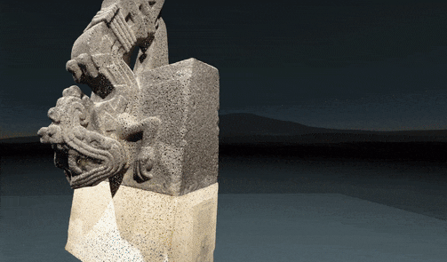

## aframe-pointcloud-component

A Point Cloud component for [A-Frame](https://aframe.io).



### API

| Property | Description | Default Value |
| -------- | ----------- | ------------- |
| src      | path to a .ply file   | "". Mandatory             |
| texture  | path to a .png file   | "". Optional             |
| size     | size of the rendered points   | 1             |
| opacity     | opacity of the rendered points   | 1             |
| size     | size of the rendered points   | 1             |
| depthWrite     | When using texture it can be useful to set this to false in order to avoid creating z-index artifacts.    | true  |

You might have to also adjust the `scale`, `position` and `rotation` properties in order to fit the point cloud to your scene.

The best way to adjust this properties is by using the awesome a-frame inspector (press `Crtl+Alt+I` in the scene window).

Take a look at the included example.

### Installation

#### Browser

Install and use by directly including the [browser files](dist):

```html
<head>
  <title>My Point Cloud Scene</title>
  <script src="https://aframe.io/releases/0.6.0/aframe.min.js"></script>
  <script src="https://unpkg.com/aframe-pointcloud-component/dist/aframe-pointcloud-component.min.js"></script>
</head>

<body>
  <a-scene>
      <a-pointcloud 
        scale="0.5 0.5 0.5" 
        position="1.5 2 0.5" 
        src="url(Sphere.ply)" 
        size="0.05"
        texture="url(firefox.png)"
        depthWrite="false">
      </a-pointcloud>
  </a-scene>
</body>
```

<!-- If component is accepted to the Registry, uncomment this. -->
<!--
Or with [angle](https://npmjs.com/package/angle/), you can install the proper
version of the component straight into your HTML file, respective to your
version of A-Frame:

```sh
angle install aframe-pointcloud-component
```
-->

#### npm

Install via npm:

```bash
npm install aframe-pointcloud-component
```

Then require and use.

```js
require('aframe');
require('aframe-pointcloud-component');
```
